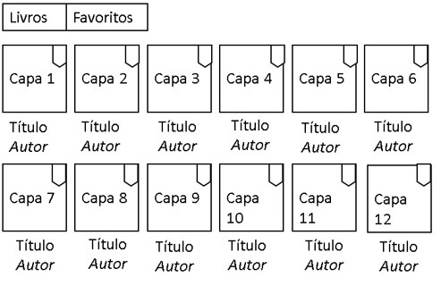
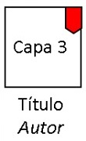
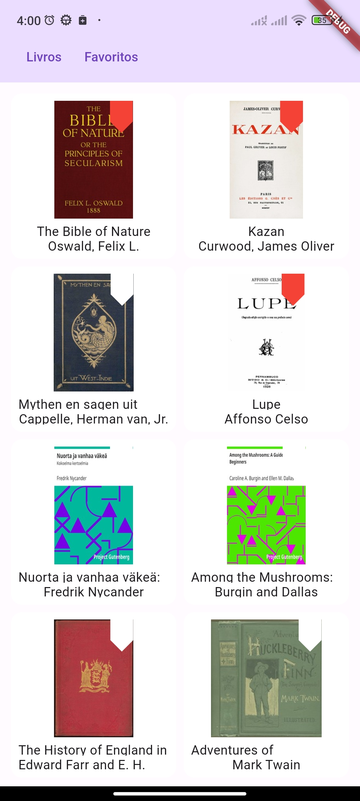
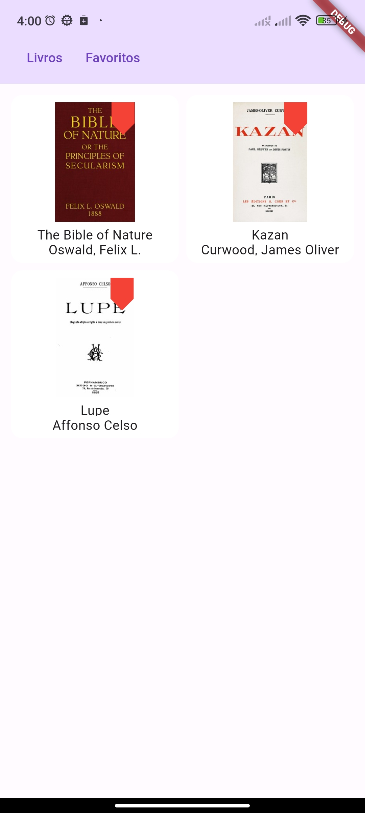
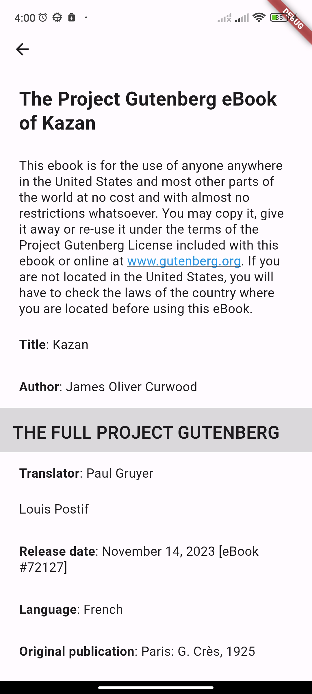
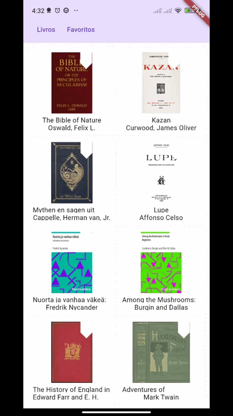

# Desafio técnico 2

<p align="center">Uma aplicação flutter, leitor de eBooks.</p>


<!--ts-->
* [O que foi solicitado](#o-que-foi-solicitado)
* [Resquisitos técnicos](#requisitos-técnicos)
* [Avaliação](#avaliaçâo)
* [Como executar](#como-executar)
* [Tecnologias](#tecnologias)
* [Autor](#autor)
<!--te-->


### O que foi solicitado

Desenvolver um aplicativo para leitura de eBooks que ofereça uma experiência interativa e fácil de usar para os usuários. O aplicativo deve ser capaz de baixar uma lista de livros e suas capas deste link, exibir as capas em uma estante virtual, permitir o download de livros e a leitura dos mesmos utilizando um plugin específico.

Funcionalidades Requeridas:
- [x] 1. Baixar Lista de Livros e Capas:
   - O aplicativo deve acessar uma API para baixar uma lista atualizada de livros e suas respectivas capas.
- [x] 2. Estante de Livros:
   - Exibir as capas dos livros baixados de forma organizada em uma estante virtual.

<h1 align="center">

</h1>

- [x] 3. Download e Armazenamento de Livros:
   - Permitir que o usuário baixe um livro ao tocar em sua capa e salve o arquivo no dispositivo.
- [x] 4. Exibição de Livros:
   - Utilizar o plugin [Vocsy Epub Viewer](https://pub.dev/packages/vocsy_epub_viewer) para exibir o conteúdo do livro.
- [x] 5. Navegação de Interface:
   - Incluir um botão para que o usuário possa retornar facilmente à estante de livros durante a leitura.
- [x] 6. Favoritos (feature bônus)
  - Criar uma aba de favoritos acima do app. Ao tocar em Favoritos serão exibidos apenas os livros favoritos.
  - Para favoritar um livro, na estante inicial, o usuário toca no marcador no canto superior direito. Essa informação deve ser persistida para quando o usuário voltar para o app.
  - Em um livro favorito, o marcador aparece em vermelho. Se tocar no marcador já acionado, ele apaga e o livro é removido da lista de favoritos.

<h1 align="center">

</h1>

### Requisitos técnicos

- O teste deve ser realizado usando Dart/Flutter na versão 3.16 ou superior.
- Organizar o código seguindo os princípios SOLID e as melhores práticas de programação.
- O código deve ser versionado em um repositório no GitHub.
- Incluir um README detalhando todos os passos necessários para executar o projeto.
- Disponibilizar no repositório do GitHub um arquivo .apk da versão final do projeto para testes.

#### Avaliação:
- Funcionalidade e aderência aos requisitos.
- Estrutura e organização do código.
- Histórico de commits no repositório GitHub.


### Demonstração

<p>

  


</p>


### Como executar

#### Pré-requisitos

Antes de começar Certifique-se de ter: 
* [Git](https://git-scm.com)
* [VSCode](https://code.visualstudio.com/)
* Um emulador instalado ou um dispositivo android conectado.


1. Clone o repisitório:
   ```sh
   git clone https://github.com/MizzaelCosta/desafio_tecnico_2.git
   ```

2. Entre na pasta do projeto: 
   ```sh
   cd desafio_tecnico_2
   ``` 

3. Abra o VSCode:
   ```sh
   code . 
   ```  

4. Instale as dependências: 
   ```sh
   flutter pub get
   ```

4. Execute: 
   ```sh
   flutter run
   ```  
    


### Tecnologias

- [Dart](https://flutter.dev/)
- [Flutter](https://flutter.dev/)
- [ValueNotifier](https://api.flutter.dev/flutter/foundation/ValueNotifier-class.html)
- [Dio](https://pub.dev/packages/dio)
- [Provider](https://pub.dev/packages/provider)
- [Path_Provider](https://pub.dev/packages/path_provider)
- [Epub_View](https://pub.dev/packages/epub_view)
- [Internet_file](https://pub.dev/packages/internet_file)
- [Mocktail](https://pub.dev/packages/mocktail)

### Autor
---

<a>
 
 <br />
 <sub><b>Mizzael Costa</b></sub></a>

 Feito por mim. 👋🏽 Entre em contato!

[](https://www.linkedin.com/in/carlosmcosta/) 
[](mailto:mizzaelcosta@gmail.com)